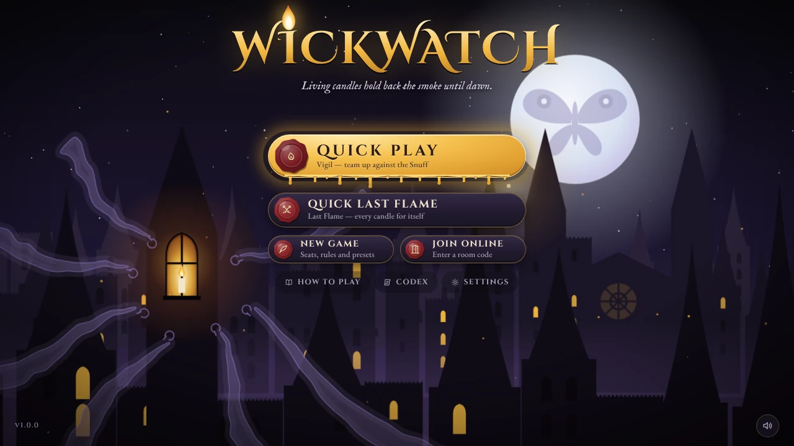
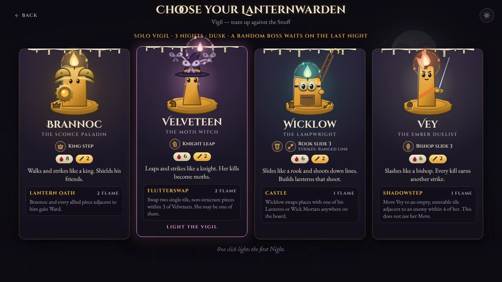
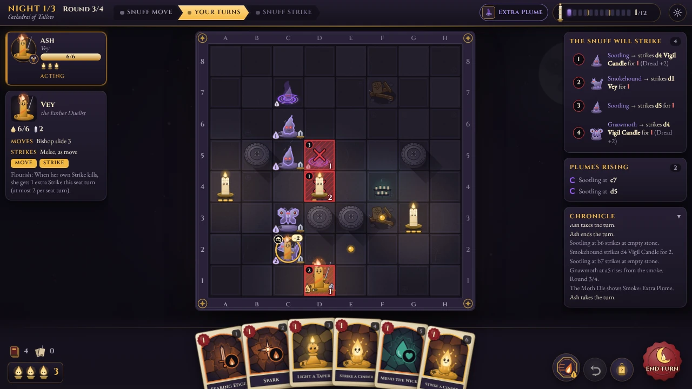
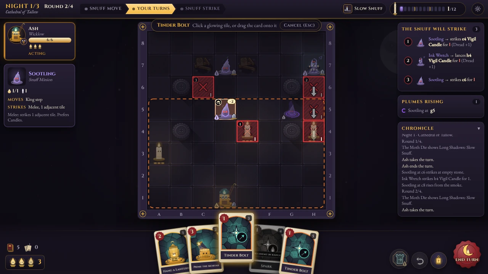
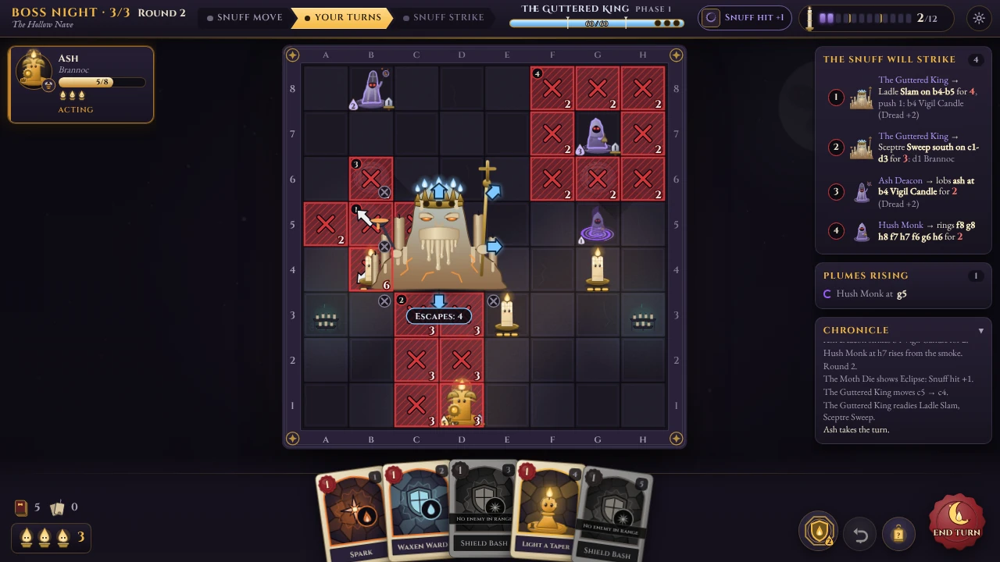
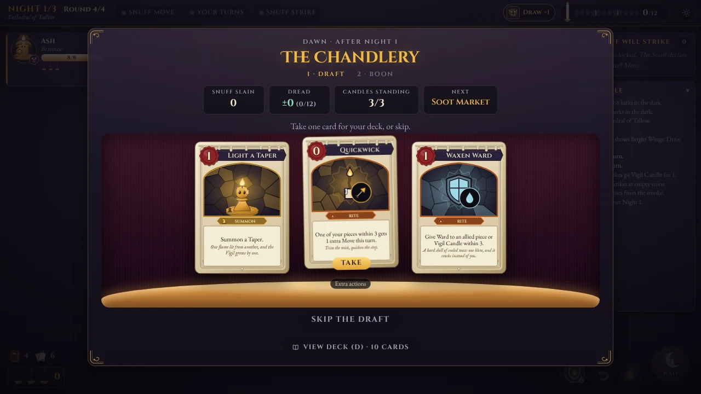
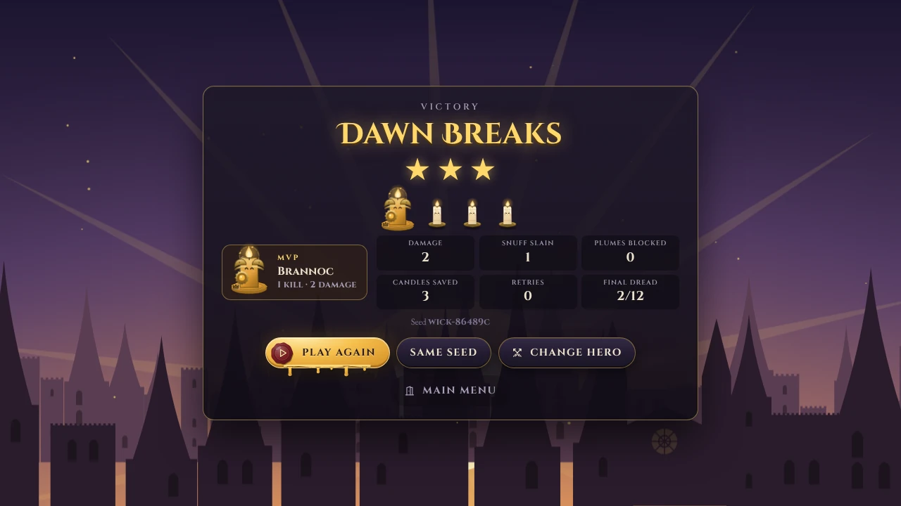
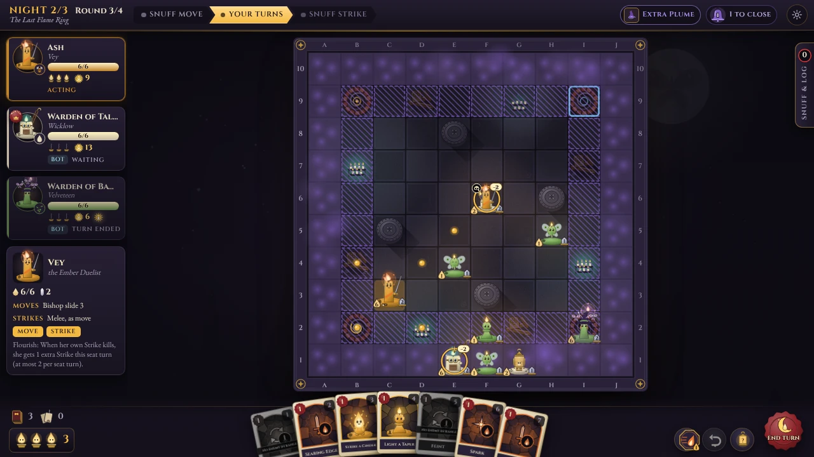
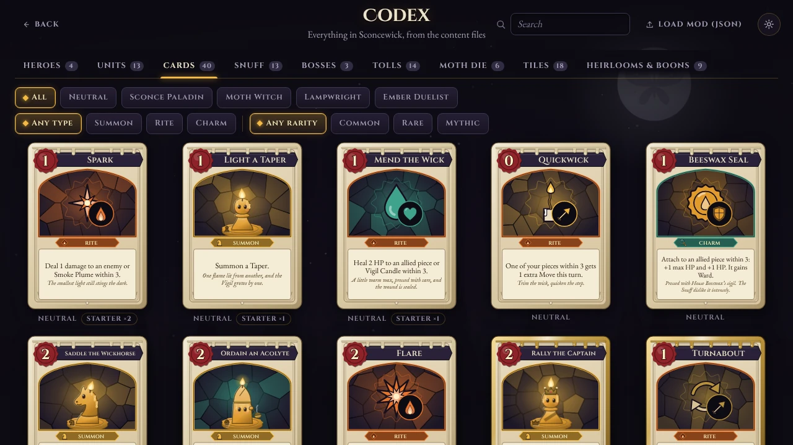
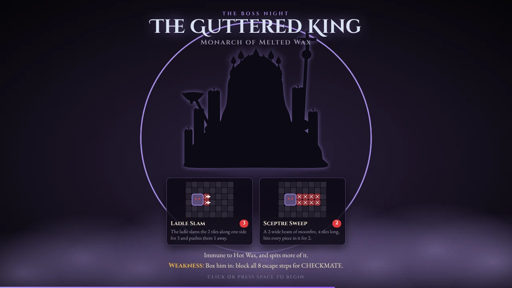

<div align="center">

# Wickwatch

**A dark-fantasy chess-and-cards vigil. Living candles hold back the smoke until dawn.**

Turn-based tactics for 1–4 players in the browser: chess-moving pieces, a small deck of cards,
enemies that show every attack before you act, and a boss fight at the end of every game.



</div>

## The pitch

**Sconcewick** is a cathedral city of living candles under the pale Moth-Moon. Every night the
**Snuff** — smoke-creatures that want every light out — pour from the chimneys and gutters, and the
city's Lanternwardens keep the **Vigil** until dawn.

You pick one of four Lanternwardens, each a chess piece with a twist: Brannoc steps like a king and
shields his friends, Velveteen leaps like a knight and turns her kills into moths, Wicklow slides like
a rook and builds lanterns that shoot, Vey slashes like a bishop and earns another strike with every
kill. On a stone chequer you move, strike and play cards against enemies whose next attack is already
painted on the board in red. Every turn is a readable puzzle: kill it, push it, block it, or step out
of the red.

- **Vigil** — co-op, 1–4 players (solo included, AI allies welcome). Keep three Vigil Candles lit
  through a run of Nights; if Dread fills the Hour Candle, the Long Night falls.
- **Last Flame** — battle royale, 2–4 players. Race your rivals for Glory while a ring of smoke, the
  Gloam, closes in Night by Night.
- **Boss Nights** — every game ends with one of three bosses: the **Hush Hierophant**, a bell that
  silences your cards; **the Guttered King**, a mountain of melted wax you can box in for CHECKMATE;
  and **Nocturna**, a moth queen who devours the brightest light on the board.

## Features

- **Two modes, one ruleset**: co-op Vigil and battle-royale Last Flame, solo, hot-seat on one screen,
  with AI allies or bots (Apprentice, Warden, Elder), or **online** with friends.
- **4 heroes, 13 units, 40 cards, 13 Snuff, 3 bosses** with 9 boss intents and three phases each.
- **Board-game furniture**: a Moth Die rolled every round, a Toll (Blessing or Curse) every Night,
  a card draft and Boons at the Chandlery between Nights, Heirlooms, a First Light token and Glory.
- **No hidden enemy moves**: every Snuff attack is locked in and shown before you act; End Turn
  previews exactly what the Snuff Strike will do.
- **A guided first Night**: the first-ever Quick Play is a scripted tutorial with coach marks that
  always ends in a double kill. Systems unlock over your first games.
- **Fully configurable**: every rule number is a parameter, presets and a Daily seed, and settings
  can be shared as a `WAX1:` code.
- **Moddable**: all content is JSON; load a mod from the Codex and every screen describes it.
- **Hand-made from code**: every piece, boss, card, tile and scene is procedural SVG/CSS, and every
  sound and the music are synthesised with WebAudio. No sprites, textures or audio files — the only
  bitmaps are the app icons, rendered from the SVG favicon.
- **Accessible**: keyboard play throughout, reduced motion, bold outlines, a readable-font switch,
  UI scale, and shapes as well as colours for every state.
- **Installable**: a web manifest and icons, so the game can be added to a home screen and run
  full-screen.

## How to play in 60 seconds

1. **Survive the Night.** In Vigil, keep the Vigil Candles lit. Each Candle hit adds Dread, and when
   Dread is full the Long Night falls. The last Night is the Boss Night: slay the boss to win. In
   Last Flame, earn the most Glory before the last Night ends.
2. **Every round has three beats.** **Snuff Move** (enemies move and paint red danger tiles) →
   **your turns** → **Snuff Strike** (the red tiles are hit). Then Plumes rise and the round is tallied.
3. **Each piece may Move once and Strike once, in either order.** Pieces move like chess pieces. The
   rune on a piece's base shows how.
4. **Melee pieces strike where they could move, and a melee kill takes the square.** Ranged pieces
   shoot along lines and stay put. Pawns are the exception: they move straight and strike diagonally.
5. **Cards cost Flame.** Each turn you get 3 Flame and draw up to 5 cards. Summons bring new pieces,
   which act from your next turn. Rites happen at once. Charms attach to a piece.
6. **Red tiles are promises.** Every enemy attack is locked in before you act. Kill the attacker,
   push it, pull it, or step out of the red. An attack aimed by an enemy moves with that enemy.
7. **Violet spirals are Smoke Plumes.** An enemy rises from each one after the Snuff Strike. Stand on
   it to block it (you take 1 damage), or strike it to pop it.
8. **Fallen heroes smolder.** A hero at 0 HP becomes a Smoldering Wick. An adjacent ally can relight
   it by using its Strike.

The full player rulebook — heroes, enemies, bosses, tiles, Tolls and every table — is in
**[docs/RULES.md](docs/RULES.md)**.

## Screenshots

| | |
|---|---|
|  |  |
| **Choose your Lanternwarden** — one click starts the game. | **A Vigil turn** — the Snuff's attacks are queued in red; Vey has a lethal strike. |
|  |  |
| **Card targeting** — range ring, valid targets and the damage preview. | **Boss Night** — the Guttered King, his escape arrows and four intents. |
|  |  |
| **The Chandlery** — the Night summary and a card draft between Nights. | **Dawn Breaks** — three stars, the MVP and the seed. |
|  |  |
| **Last Flame** — Glory on the plaques, the Gloam Bell and the smoke ring. | **The Codex** — every card, piece and rule, rendered live from the content. |

<details>
<summary>The boss intro</summary>



</details>

## Quick start

You need **Node.js 20.19 or newer** (CI uses Node 22).

```bash
npm install
npm run dev          # the game with hot reload on http://localhost:5173
```

| Command | What it does |
|---|---|
| `npm run dev` | Vite dev server on port 5173 (also on your LAN). `/ws` is proxied to the game server on 8787. |
| `npm run build` | Typecheck, then a production build into `dist/`. |
| `npm run preview` | Serve `dist/` with Vite (port 4173). |
| `npm start` | **One command for online and LAN play**: build, then start the game server. |
| `npm run server` | Start the game server for an existing `dist/`: the game and its WebSocket on one port. |
| `npm run typecheck` | `tsc` for the client and the server configs. |
| `npm test` | The unit suite (Vitest). |

### Online and LAN play

```bash
npm start            # = npm run build && npm run server
```

Open **<http://localhost:8787>**. The server also prints its LAN addresses
(`on your network: http://192.168.1.20:8787`): friends on the same network open that address, one
player hosts from **New Game → Host Online**, and the others choose **Join Online** and type the
4-letter room code. The server is authoritative: it runs the rules, the bots and the turn timers, and
a running game survives a server restart.

| Variable | Default | Meaning |
|---|---|---|
| `PORT` | `8787` | HTTP + WebSocket port. |
| `HOST` | all interfaces | Bind address (`127.0.0.1` to stay local). |
| `WICKWATCH_DIST` | `dist/` | The built client to serve. |
| `WICKWATCH_DATA` | `server/data/` | Where running games are saved. |

For online development, run `npm run server` in one terminal and `npm run dev` in another: the dev
server forwards `/ws` to port 8787. In the lobby, **Server address (advanced)** points the client at
any other server (`192.168.1.20:8787`, `wss://example.org/ws`).

The static build (`dist/`, relative paths) also runs from any file host — GitHub Pages, itch.io — for
solo and hot-seat play; online play needs the Node server.

## Controls

| Input | Action |
|---|---|
| Click | Select a piece, then click a gold dot to move or a gold ring to strike. Click a card, then a glowing tile — or drag the card onto it. |
| Shift-click | On a Smoke Plume: step onto it to block it, instead of striking it. |
| Right-click | Cancel; on an empty tile with nothing selected, ping it (a transient marker in your House colour). |
| Mouse wheel / drag | Zoom about the cursor; drag the zoomed board to pan. |
| G | Ping the tile under the cursor. |
| Space | End turn (hover End Turn first to preview the Snuff Strike). |
| Enter | Confirm (the keyboard cursor's tile, or the selected card). |
| Z | Undo |
| 1–8 | Select a card in your hand |
| Tab / Shift+Tab | Cycle through your Ready pieces (while the board has focus) |
| Arrow keys | Move the keyboard cursor |
| Esc | Cancel; with nothing to cancel, the pause menu |
| P | Hero Power |
| C | Claim the turn (co-op) |
| D | Deck viewer |
| H | Hint |
| I | Toggle the intent overlay |
| R | Rules overlay |
| + / − | Zoom |

**Touch**: tap to select and act, long-press to inspect, pinch to zoom and pan, two-finger tap to
ping. End Turn takes two taps: the first shows the Snuff Strike preview, the second confirms.

## Configuration

- **Quick Play** (solo Vigil) and **Quick Last Flame** (you and two Warden bots) start in one click
  after choosing a hero. Your first Quick Play is the guided First Vigil.
- **New Game** opens the **Setup** screen: the mode, up to four seats (human, AI ally or bot, each
  with a hero), and the options.
  - **Preset chips**: Short, Standard, Long, **Daily**, and three **Custom** slots saved on this device.
  - **Basic**: difficulty (Candlelit, Dusk, Midnight, Witching Hour), length, boss, board size.
  - **Advanced**: every rule parameter of the current mode, each with a tooltip — Flame per turn,
    hand size, unit limit, Tolls, Moth Die, Boons, Retry, Dread, enemy and Plume modifiers, boss HP,
    turn timer, Truce, Bounty, Haunting, the seed, and more. Illegal combinations are greyed out with
    the reason.
- **Settings codes**: **Copy settings code** gives a `WAX1:` code — URL-safe base64 of the presets,
  the parameters that differ from them, and the content hash. **Paste code** applies one: unknown
  keys are ignored, out-of-range values are clamped, and both are listed in a toast. A code made with
  different content (mods) says so.
- **Daily**: everyone gets the same game for the UTC date (seed `daily:YYYY-MM-DD`): solo Vigil,
  Standard, Dusk, a boss drawn from the seed, any hero. Retry and mods are disabled.
- **Seeds**: the same seed and the same moves always give the same game. The seed is shown at the
  end; **Same Seed** replays it.
- **Settings** (per device): animation and enemy-turn speed, reduced motion, screen shake, bold
  outlines, readable font, UI scale, End Turn confirmation, tutorial hints, and volumes.

## Modding

All game content is data in [`src/content/`](src/content): `heroes`, `powers`, `traits`, `units`,
`cards`, `enemies`, `bosses`, `boss_intents`, `tolls`, `omens`, `heirlooms`, `boons`, `tiles`,
`overlays`, `tokens`, `statuses`, `ranks`, `houses`, `bots`, `runes`, `sites`, `maps`, `difficulty`,
`lengths`, `config_defaults`, `reasons` and `rules`. The engine validates every file on load (schema,
references, ranges), and behaviour is referenced by id, so most changes need no code.

A **mod** is one JSON object keyed by content file name:

- `"<file>": [entries]` — an entry whose `id` exists is **deep-merged** over the original (objects
  merge key by key, **arrays replace**); an entry with a new `id` is added.
- `{ "id": "x", "$remove": true }` removes an entry.
- `"rules": { ... }` is merged as an object over [`rules.json`](src/content/rules.json).
- The result is fully re-validated; on any error nothing changes and every problem is listed with its
  file and path. Limit: 1 MB.

**Example** — a brighter Spark (2 damage, range 4), no Dawnbreak, and room for 7 Flame:

```json
{
  "cards": [
    {
      "id": "spark",
      "target": { "range": { "max": 4 } },
      "effects": [{ "op": "damage", "amount": 2 }],
      "text": "Deal 2 damage to an enemy or Smoke Plume within 4."
    },
    { "id": "dawnbreak", "$remove": true }
  ],
  "rules": { "flameCap": 7 }
}
```

Load it from **Codex → Load mod (JSON)** (paste it or pick the file). The Codex and every new game
use it at once; **Reset to base content** removes it. A loaded mod changes the content hash,
disables the Daily, and is marked in settings codes. Online play uses the base content only: the
server turns away a client with a mod loaded, so reset to the base content before hosting or joining.

## Project structure

```
src/
  engine/      Pure, deterministic rules engine: state, reducer, phases, combat, cards, Snuff AI,
               bosses, Last Flame, bots, previews. No DOM, no randomness outside seeded streams.
  content/     The game data (JSON), validated into a typed registry; mods merge over it.
  config/      Rule parameters, presets, the settings code, presentation settings, local profile.
  game/        The client controller: dispatch, event playback, pacing, bots in a Web Worker.
  net/         Online client: the wire protocol (shared with the server), session, NetTransport.
  ui/          React screens (title, hero picker, setup, lobby, How to Play, Codex, settings) and
               the game screen (board, hand, rails, overlays); ui/fx has the canvas lighting.
  art/         Procedural SVG/CSS art: pieces, bosses, tiles, cards, sigils, scenes, the Moth Die.
  audio/       WebAudio synthesised sound effects and generative music.
server/        Node WebSocket server: rooms, lobby, the authoritative game, bots, timers, persistence.
scripts/       rules-tables.ts (RULES.md tables), render-icons.ts (app icons), capture-screenshots.ts.
tests/unit/    Vitest: engine, config, game controller, UI (jsdom), net, art, docs.
tests/e2e/     Playwright: Quick Play and the tutorial, Boss Night, Last Flame, overlays, online.
docs/          GDD.md (design), ARCHITECTURE.md (code contract), RULES.md (player rules).
```

## Testing

```bash
npm run typecheck                       # client and server tsconfigs
npm test                                # Vitest unit suite (a few minutes)
npx vitest run tests/unit/engine        # one area
npx playwright install chromium         # once
npx playwright test                     # e2e: builds, serves with vite preview, runs tests/e2e
```

- The Playwright config builds the game and serves it with `vite preview` on port 4173
  (`WICKWATCH_E2E_PORT` to change it); the online test starts its own game server on a free port.
- `PLAYWRIGHT_CHROMIUM_PATH=/path/to/chrome` uses an existing Chromium instead of the installed one.
- After changing content, refresh the rules tables with `npx tsx scripts/rules-tables.ts`
  (`--check` fails when docs/RULES.md is out of date; CI runs it).
- After changing the look of the game, refresh the screenshots: build, start `npx vite preview`,
  then run `npx tsx scripts/capture-screenshots.ts` (writes `docs/screenshots/*.webp`).
- CI (`.github/workflows/ci.yml`) runs the typecheck, the docs check, the unit suite, the build and
  the e2e suite on every push and pull request.

## Under the hood

- **Deterministic engine.** `applyAction(state, action)` is a pure reducer over plain-JSON state.
  All randomness comes from named mulberry32 streams stored in the state (`setup`, `map`, `spawn`,
  `omen`, `toll`, `decks:<seat>`, `draft:<seat>`, `bot:<seat>`), so a seed plus an action log replays
  a game exactly: Same Seed and the Daily rely on it, and the server rebuilds running games from their
  logs after a restart. Undo and Retry this Night restore saved snapshots, RNG positions included. The
  End Turn preview runs the real Snuff Strike on a copy of the state.
- **Events for presentation.** Every visible change is a typed event; the client animates events in
  order and then snaps to the authoritative state.
- **Bots** plan within node-expansion budgets, not milliseconds, so a plan does not depend on the
  machine's speed (a wall-clock cap is only a safety net). They draw randomness from their own
  stream, run in a Web Worker in the browser and in-process on the server.
- **Procedural art and audio.** SVG components and CSS transforms for every figure (no animated SVG
  filters), one canvas for lighting and one for particles; synthesised SFX and generative music
  that follows the Night.
- **Server-authoritative online.** Clients send actions; the server validates and applies them,
  sends each seat its own view (rivals' hands and deck orders hidden), paces the automated phases
  for everyone, runs bots and turn timers, keeps a seat for a reconnecting player before a bot stands
  in, and salts the seed so nobody can predict draws — the salt is revealed at game over.
- **Small first load.** The heavy screens (the game, Setup, the lobby, How to Play, the Codex) are
  separate chunks fetched in the background once the Title is up; React has its own long-cached chunk.

## Documentation

- **[docs/RULES.md](docs/RULES.md)** — the player's rulebook.
- **[docs/GDD.md](docs/GDD.md)** — the game design document: the source of truth for rules, numbers,
  ids, art and UX.
- **[docs/ARCHITECTURE.md](docs/ARCHITECTURE.md)** — where code lives, the module contracts and the
  coding rules.
